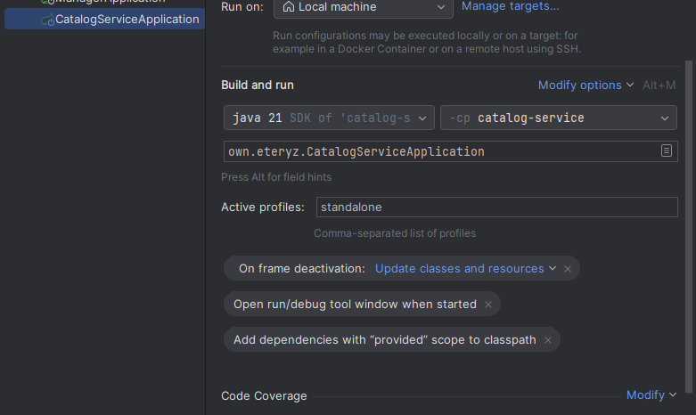

Для запуска проекта с названием конфигурации application-standalone.yaml необходимо заполнить поле Active profiles.

Информацию о пользователе в контроллере можно получить через 
аргументы метода
- (Principal principal)
- (@AuthenticationPrincipal UserDetails userDetails)
